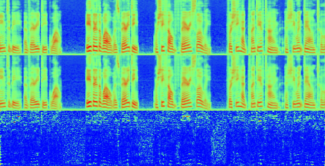

#   NeuralCodecs [](https://www.nuget.org/packages/NeuralCodecs)

NeuralCodecs is a .NET library for neural audio codec implementations and TTS models written purely in C#. It includes implementations of SNAC, DAC, Encodec, and Dia, along with advanced audio processing tools.

## Features
- **SNAC**: [Multi-**S**cale **N**eural **A**udio **C**odec](https://github.com/hubertsiuzdak/snac)
  - Support for multiple sampling rates: 24kHz, 32kHz, and 44.1kHz
  - Attention mechanisms with adjustable window sizes for improved quality
  - Automatic resampling for input flexibility
- **DAC**: [Descript Audio Codec](https://github.com/descriptinc/descript-audio-codec)
  - Supports multiple sampling rates: 16kHz, 24kHz, and 44.1kHz
  - Configurable encoder/decoder architecture with variable rates
  - Flexible bitrate configurations from 8kbps to 16kbps
- **Encodec**: [Meta's Encodec neural audio compression](https://github.com/facebookresearch/encodec)
  - Supports stereo audio at 24kHz and 48kHz sample rates
  - Variable bitrate compression (1.5-24 kbps)
  - Neural language model for enhanced compression quality
  - Direct file compression to .ecdc format
- **Dia**: [Nari Labs' Dia text-to-speech model](https://github.com/nari-labs/dia)
  - 1.6B parameter text-to-speech model for highly realistic dialogue generation
  - Direct transcript-to-speech generation with emotion and tone control
  - Audio-conditioned generation for voice cloning and style transfer
  - Support for non-verbal communications (laughter, coughing, throat clearing, etc.)
  - Speaker-aware dialogue generation with [S1] and [S2] tags
  - Custom dynamic speed control to handle Dia's issue with automatic speed-up on long inputs
- **AudioTools**: Advanced audio processing utilities
  - Based on Descript's [audiotools](https://github.com/descriptinc/audiotools) Python package
  - Extended with .NET-specific optimizations and additional features
  - Audio filtering, transformation, and effects processing
  - Works with Descript's AudioSignal or Tensors
- **Audio Visualization**: Example project includes spectrogram generation and comparison tools

## Requirements
- .NET 8.0 or later
- TorchSharp or libTorch compatible with your platform
- NAudio (for audio processing)
- SkiaSharp (for visualization features)

## Installation  
Install the main package from NuGet:  
```bash
dotnet add package NeuralCodecs
```

Or the Package Manager Console:  
```powershell
Install-Package NeuralCodecs
```

## Model Downloads

Models will be automatically downloaded given the huggingface user/model, or can be downloaded separately:

**SNAC Models** - Available from [hubersiuzdak's HuggingFace](https://huggingface.co/hubertsiuzdak)

**DAC Models** - Available from [Descript's HuggingFace](https://https://huggingface.co/descript)

**Encodec Models** - Available from [Meta's HuggingFace](https://huggingface.co/facebook)

**Dia Model** - Available from [Nari Labs' HuggingFace](https://https://huggingface.co/nari-labs/Dia-1.6B)
- *Requires both Dia model weights and DAC codec for full audio generation*

## Quick Start

Here's a simple example to get you started:

```csharp
using NeuralCodecs;

// Load a SNAC model
var model = await NeuralCodecs.CreateSNACAsync("path/to/model.pt");

// Process audio
float[] audioData = LoadAudioFile("input.wav");
var compressed = model.ProcessAudio(audioData, sampleRate: 24000);

// Save the result
SaveAudioFile("output.wav", compressed);
```

For more detailed examples, see the examples section below.

## Usage

### Creating/loading the model

There are several ways to load a model:

1. #### Using static factory method:
```csharp
// Load SNAC model with static method provided for built-in models
var model = await NeuralCodecs.CreateSNACAsync("model.pt");
```

2. #### Using  premade config:
    SnacConfig provides premade configurations for 24kHz, 32kHz, and 44kHz sampling rates.
```csharp
var model = await NeuralCodecs.CreateSNACAsync(modelPath, SNACConfig.SNAC24Khz);
```

3. #### Using IModelLoader instance with default config:
    Allows the use of custom loader implementations
```csharp
// Load model with default config from IModelLoader instance
var torchLoader = NeuralCodecs.CreateTorchLoader();
var model = await torchLoader.LoadModelAsync<SNAC, SNACConfig>("model.pt");
```

4. #### Using IModelLoader instance with custom config:
```csharp
// For Encodec with custom bandwidth and settings
var encodecConfig = new EncodecConfig { 
    SampleRate = 48000,
    Bandwidth = 12.0f,
    Channels = 2,  // Stereo audio
    Normalize = true
};
var encodecModel = await torchLoader.LoadModelAsync<Encodec, EncodecConfig>("encodec_model.pt", encodecConfig);
```

5. #### Using factory method for custom models:
      Allows the use of custom model implementations with built-in or custom loaders
```csharp
// Load custom model with factory method
var model = await torchLoader.LoadModelAsync<CustomModel, CustomConfig>(
    "model.pt",
    config => new CustomModel(config, ...),
    config);
```

Models can be loaded in Pytorch or Safetensors format.

### AudioTools Features

The AudioTools namespace provides extensive audio processing capabilities:

```csharp
var audio = new Tensor(...); // Load or create audio tensor

// Apply effects
var processedAudio = AudioEffects.ApplyCompressor(
    audio, 
    sampleRate: 48000,
    threshold: -20f,
    ratio: 4.0f);

// Compute spectrograms and transforms
var spectrogram = DSP.MelSpectrogram(audio, sampleRate);
var stft = DSP.STFT(audio, windowSize: 1024, hopSize: 512, windowType: "hann");
```

### Encoding and Decoding Audio

There are two main ways to process audio:

1. Using the simplified ProcessAudio method:
```csharp
// Compress audio in one step
var processedAudio = model.ProcessAudio(audioData, sampleRate);
```

2. Using separate encode and decode steps:
```csharp
// Encode audio to compressed format
var codes = model.Encode(buffer);

// Decode back to audio
var processedAudio = model.Decode(codes);
```

3. Saving the processed audio
    
    Use your preferred method to save WAV files
```csharp
// using NAudio
await using var writer = new WaveFileWriter(
    outputPath,
    new WaveFormat(model.Config.SamplingRate, channels: model.Channels)
);
writer.WriteSamples(processedAudio, 0, processedAudio.Length);
```
### Encodec-Specific Features

Encodec provides additional capabilities:

```csharp
// Set target bandwidth for compression (supported values depend on model)
encodecModel.SetTargetBandwidth(12.0f); // 12 kbps

// Get available bandwidth options
var availableBandwidths = encodecModel.TargetBandwidths; // e.g. [1.5, 3, 6, 12, 24]

// Use language model for enhanced compression quality
var lm = await encodecModel.GetLanguageModel();
// Apply LM during encoding/decoding for better quality

// Direct file compression
await EncodecCompressor.CompressToFileAsync(encodecModel, audioTensor, "audio.ecdc", useLm: true);

// Decompress from file
var (decompressedAudio, sampleRate) = await EncodecCompressor.DecompressFromFileAsync("audio.ecdc");

```

### Dia Text-to-Speech Features

Dia is a 1.6B parameter text-to-speech model that generates highly realistic dialogue directly from transcripts:

```csharp
// Load Dia model with optional DAC codec
var diaConfig = new DiaConfig 
{ 
    LoadDACModel = true,
    SampleRate = 44100 
};
var diaModel = NeuralCodecs.CreateDiaAsync("model.pt", diaconfig)

// or use LoadDACModel = false in config and manually load DAC:
diaModel.LoadDacModel("dac_model.pt");

// Basic text-to-speech generation
var text = "[S1] Hello, how are you today? [S2] I'm doing great, thanks for asking!";
var audioOutput = diaModel.Generate(
    text: text,
    maxTokens: 1000,
    cfgScale: 3.0f,
    temperature: 1.2f,
    topP: 0.95f);

// Voice cloning with audio prompt
var audioPromptPath = "reference_voice.wav";
var clonedAudio = diaModel.Generate(
    text: "[S1] This is my cloned voice speaking new words.",
    audioPromptPath: audioPromptPath,
    maxTokens: 1000);

// Batch generation for multiple texts
var texts = new List<string>
{
    "[S1] First dialogue line.",
    "[S2] Second dialogue line with (laughs) non-verbal."
};
var batchResults = diaModel.Generate(texts, maxTokens: 800);

// Save generated audio
Dia.SaveAudio("output.wav", audioOutput);
```

#### Advanced Dia Configuration

**Audio Speed Correction:**
Dia includes built-in speed correction to handle the automatic speed-up issue on longer inputs:

```csharp
var diaConfig = new DiaConfig 
{ 
    LoadDACModel = true,
    SampleRate = 44100,
    // Configure speed correction method
    SpeedCorrectionMethod = AudioSpeedCorrectionMethod.Hybrid, // Default: best quality
    // Configure slowdown mode
    SlowdownMode = AudioSlowdownMode.Dynamic // Default: adapts to text length
};
```

#### Available speed correction methods:
- **None**: No speed correction applied
- **TorchSharp**: TorchSharp-based linear interpolation
- **Hybrid**: Combines TorchSharp and NAudio methods (recommended)
- **NAudioResampling**: Uses NAudio resampling for speed correction
- **All**: Creates separate outputs using all methods (for testing/comparison)

#### Available slowdown modes:
- **Static**: Uses a fixed slowdown factor
- **Dynamic**: Adjusts slowdown based on text length (recommended)


**Speed Correction Examples:**
```csharp
// For highest quality output (default)
var highQualityConfig = new DiaConfig 
{ 
    SpeedCorrectionMethod = AudioSpeedCorrectionMethod.Hybrid,
    SlowdownMode = AudioSlowdownMode.Dynamic
};

// For testing multiple correction methods
var testConfig = new DiaConfig 
{ 
    SpeedCorrectionMethod = AudioSpeedCorrectionMethod.All // Generates multiple output variants
};

// For no speed correction (fastest processing)
var fastConfig = new DiaConfig 
{ 
    SpeedCorrectionMethod = AudioSpeedCorrectionMethod.None
};
```

#### Dia Generation Guidelines

**Memory Usage:** Similar to the python implementation, ~10-11GB GPU memory is required for the Dia model with DAC codec.

**Text Format Requirements:**
- Always begin input text with `[S1]` speaker tag
- Alternate between `[S1]` and `[S2]` for dialogue (repeating the same speaker tag consecutively may impact generation)
- Keep input text moderate length (10-20 seconds of corresponding audio)

**Non-Verbal Communications:**
Dia supports various non-verbal tags. Some work more consistently than others (laughs, chuckles), but be prepared for occasional unexpected output from some tags (sneezes, applause, coughs ...) 
```csharp
var textWithNonVerbals = "[S1] I can't believe it! (gasps) [S2] That's amazing! (laughs)";
```

Supported non-verbals: `(laughs)`, `(clears throat)`, `(sighs)`, `(gasps)`, `(coughs)`, `(singing)`, `(sings)`, `(mumbles)`, `(beep)`, `(groans)`, `(sniffs)`, `(claps)`, `(screams)`, `(inhales)`, `(exhales)`, `(applause)`, `(burps)`, `(humming)`, `(sneezes)`, `(chuckle)`, `(whistles)`

**Voice Cloning Best Practices:**
- Provide 5-10 seconds of reference audio for optimal results
- Include the transcript of the reference audio before your generation text
- Use correct speaker tags in the reference transcript
- Approximately 1 second  per 86 tokens for duration estimation

```csharp
// Voice cloning example with transcript
var referenceTranscript = "[S1] This is the reference voice speaking clearly.";
var newText = "[S1] Now I will say something completely different.";
var clonedOutput = diaModel.Generate(
    text: referenceTranscript + " " + newText,
    audioPromptPath: "reference.wav");
```

## Example

Check out the Example project for a complete implementation, including:
- Model loading and configuration
- Audio processing workflows
- Command-line interface implementation
- Audio Visualization

The example includes tools for visualizing and comparing audio spectrograms:

*Audio before and after compression with DAC Codec 24kHz*  


## Acknowledgments
- [SNAC](https://github.com/hubertsiuzdak/snac) - hubertsiuzdak's original python implementation
- [Descript Audio Codec](https://github.com/descriptinc/descript-audio-codec) - Descript's original python implementation
- [Encodec](https://github.com/facebookresearch/encodec) - Meta's original python implementation
- [Dia](https://github.com/nari-labs/dia) - Nari Labs' original python implementation

## Contributing

Suggestions and contributions are welcome! Here's how you can help:

### Ways to Contribute
- **Bug Reports**: Submit issues with reproduction steps
- **Feature Requests**: Propose new codec implementations or features
- **Code Contributions**: Submit pull requests with improvements
- **Documentation**: Help improve examples and documentation
- **Testing**: Test with different models and platforms

## License
This project is licensed under the Apache-2.0 License, see the LICENSE file for more information.  
This project uses libraries under several different licenses, see THIRD-PARTY-NOTICES for more information.
